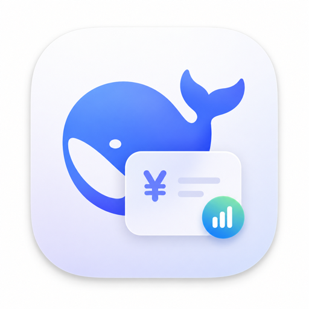
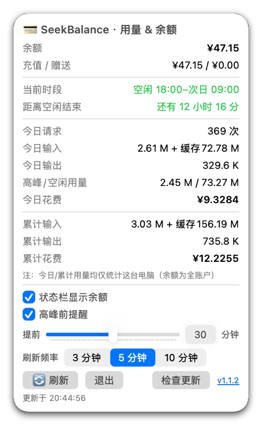
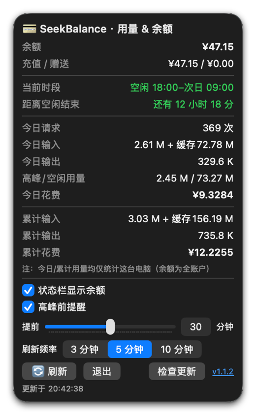

# SeekBalance

> English · [简体中文](README.md)

<p align="center">
  
</p>

<p align="center">
  <strong>Your DeepSeek balance and usage, at a glance.</strong>
</p>

<p align="center">
  SeekBalance is a macOS menu bar utility that shows your DeepSeek API balance, today's usage, and cost estimates in real time — and reminds you to avoid peak hours so you can use the API for less.
</p>

<p align="center">
  <a href="https://github.com/VincentPhoton/SeekBalance/releases/latest"><strong>Download latest</strong></a> ·
  <a href="#highlights">Highlights</a> ·
  <a href="#screenshots">Screenshots</a> ·
  <a href="#installation">Installation</a> ·
  <a href="#prerequisites">Prerequisites</a> ·
  <a href="#data-sources--security">Security</a> ·
  <a href="#uninstall">Uninstall</a>
</p>

<p align="center">
  <a href="https://github.com/VincentPhoton/SeekBalance/releases/latest">
    
  </a>
</p>

<p align="center">
  
  
  
  
</p>

## Screenshots

Automatically adapts to light / dark mode (click for full size):

| Light mode | Dark mode |
| :---: | :---: |
|  |  |

## Highlights

### At a glance in the menu bar

Your balance (e.g., `¥7.85`) lives right in the menu bar — no Dock icon, no popups. The balance text can be toggled on/off. **Left-click** opens the full panel; **right-click** opens a quick menu (Refresh / Check for Updates / About / GitHub / Quit).

### Peak / off-peak status & saving money

- **Current period at a glance**: the panel shows whether it is peak or off-peak (with the time range) and counts down to the end of the current period; the countdown turns red when off-peak has ≤ 30 minutes left
- **Peak reminders**: schedule a system notification 0–60 minutes before the peak starts — "peak is coming, prices will go up"
- **Precise cost calculation**: fully supports DeepSeek's latest peak/off-peak pricing (peak 9:00–12:00, 14:00–18:00 Beijing time; off-peak otherwise), estimating each request by its actual time

### Usage & cost stats

- **Today's usage**: request count, input (miss + cache), output, with **peak and off-peak usage split**
- **Cumulative usage & cost**: input / output / precise cost estimate
- **Auto-refresh**: interval selectable (3 / 5 / 10 minutes, default 5); refreshes instantly when the panel opens

### Easy first-run setup

Open the app and **paste your DeepSeek API key in the panel** — it is stored in the macOS Keychain (system-encrypted), no config file needed (dsh users can keep using their existing config).

### Check for updates

Click "Check for Updates" in the panel or the right-click menu: it compares against the latest GitHub release and **downloads, installs, and relaunches automatically**; if already up to date, a dialog shows the last check time.

## Installation

1. Download the latest `SeekBalance-1.1.4-arm64.dmg` from [Releases](https://github.com/VincentPhoton/SeekBalance/releases/latest)
2. Open the DMG and drag `SeekBalance.app` into "Applications"
3. If macOS says "cannot verify the developer" on first launch: right-click → Open → Open again
4. The DMG includes the "UninstallSeekBalance" one-click uninstaller

### Build from source

Requires macOS 13+ and Swift 5.9+:

```sh
cd SeekBalance
SWIFTPM_CACHE_DIR=/tmp/swiftpm-cache swift build -c release
# Self-check (prints a report and exits):
./.build/release/SeekBalance --once
```

## System requirements

- macOS 13+
- Apple Silicon (M1 / M2 / M3 / M4, arm64)
- [zstd](https://github.com/facebook/zstd) (`brew install zstd`, used to decompress dsh session logs, auto-detected)

## Prerequisites

| Dependency | Description |
|---|---|
| API key | Either way works: ① open the app and paste the key in the panel (stored in the macOS Keychain, system-encrypted); ② or create a config file `~/.dsh/.credentials.yaml` with one line: `DEEPSEEK_API_KEY: your-key` (dsh users already have this file). The key is only used to call DeepSeek's official API |
| dsh session logs (optional) | With dsh you get today/cumulative usage stats; without it, usage stays empty and only the balance is available |

## Data sources & security

| Data | Source | Scope |
|---|---|---|
| Balance | `GET https://api.deepseek.com/user/balance` (Bearer auth) | **Whole account**, real-time & accurate |
| Today's usage | Local `~/.dsh/sessions/*/*/session.jsonl.zstd` session logs | **This machine only** |
| Cumulative usage | Local `~/.dsh/storages/session_projcache.json` | **This machine only** |
| Cost | Precise estimate per request by actual time, adapting to the latest peak/off-peak pricing | **This machine only, not an official bill** |

- Your API key is **only** used to request DeepSeek's official endpoint (`api.deepseek.com`) and is never sent to any third party
- This tool **does not upload any statistics**; all usage data comes from your local dsh files
- DeepSeek does **not provide a public usage-query API** (tested `/user/usage` etc. all return 404), so usage stats can only be read from local records

## Uninstall

- Use the built-in "UninstallSeekBalance" one-click uninstaller in the DMG, or manually delete `/Applications/SeekBalance.app`
- Manual leftovers: `~/Library/Preferences/local.seekbalance.plist`, `~/Library/Caches/local.seekbalance/`, etc.
- Uninstalling does **not** delete `~/.dsh/` data (shared with dsh)

## Build

- Build: `swift build -c release`
- Create DMG: `hdiutil create -volname "SeekBalance" -srcfolder dmg-build -ov -format UDZO -fs HFS+ "SeekBalance-1.1.4-arm64.dmg"` (put the `.app`, an Applications shortcut, the uninstaller, and install notes into `dmg-build/`)

## License

[MIT](LICENSE)

## Disclaimer

This project is not affiliated with DeepSeek; it is a third-party community tool. Cost estimates are for reference only; actual charges are subject to DeepSeek's official billing.
